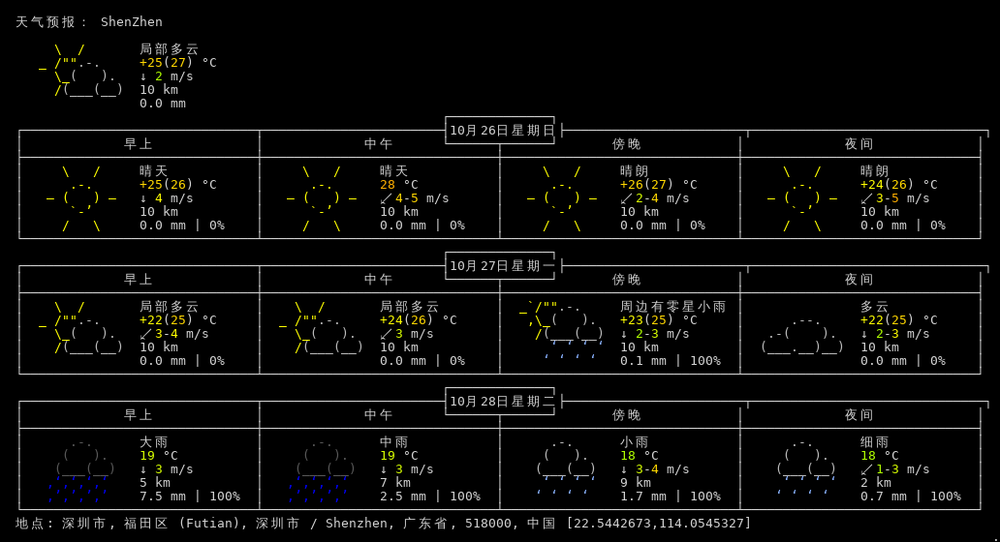

介绍

基于wttr这个获取深圳最近三天的天气 ,并生成图片至于assets目录;

用github action机制,十分钟跑一次;

哇哈哈,这个主要用来装饰github profile 用的, 如果结合企业微信,钉钉这种也能做推送;

## 脚本参数介绍

```bash
#!/bin/bash

set -eux

CITY=ShenZhen.png # 城市名字 + .png是生成图片,不带就只有terminal stdout log
LANGUAGE="zh-CN" # 返回信息的语种


if [ ! -d "assets" ]; then
  mkdir assets
  chmod 755 assets
fi

curl -fGsS -H "Accept-Language: ${LANGUAGE}" --compressed "wttr.in/${CITY}?m\&F\&p\&M\&A\&u\&M\&m" -o assets/$CITY

cur_dateTime="`date +%Y-%m-%d,%H:%m:%s`"  
# 增加执行时间,并输出到文件,避免生成图片没有任何变更,导致Action执行异常
# 不追加,防止文件变得异常庞大
echo "Script execution date: ${cur_dateTime}"  > weather-shell.log

```

## 效果图



## 更多

更多参数可以参考 [wttr help](https://wttr.in/:help "wttr 帮助文档")

## 温馨提示

jsdelivr 支持github静态资源cdn 外链 !

[jsDelivr - A free, fast, and reliable CDN for open source](https://www.jsdelivr.com/?docs=gh)
